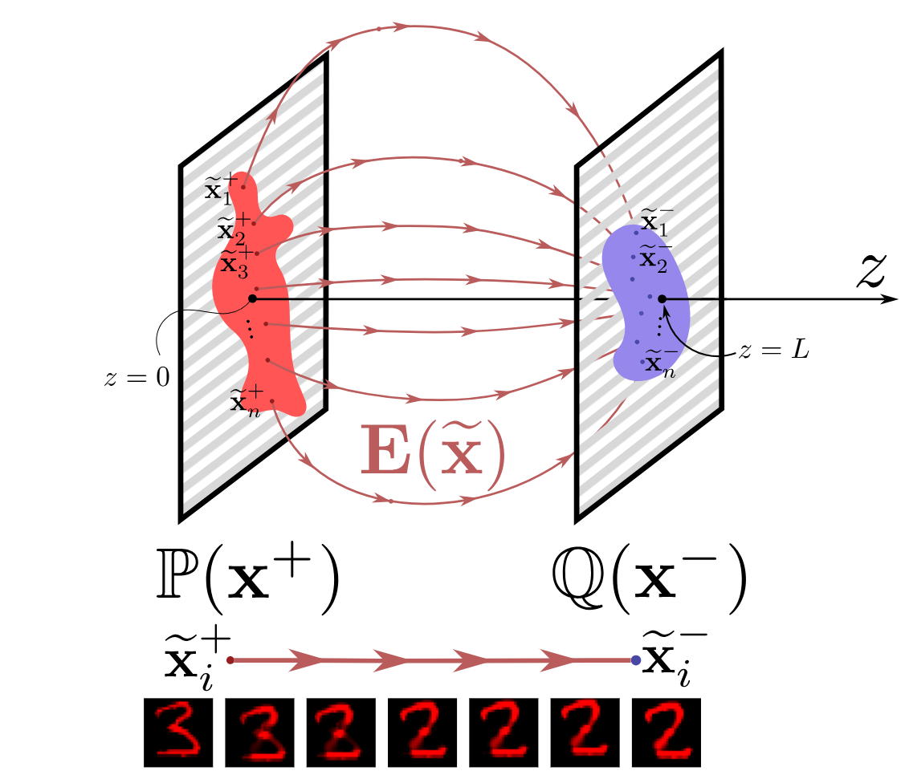
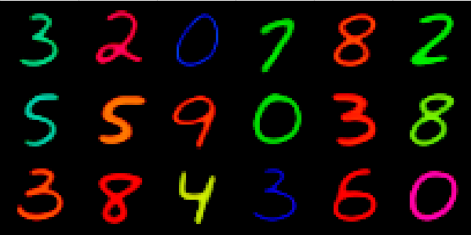
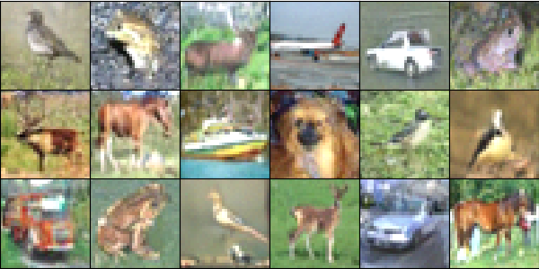
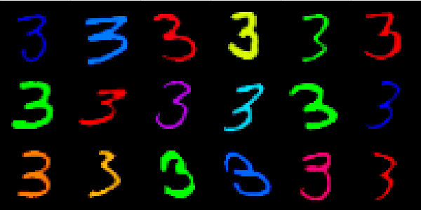
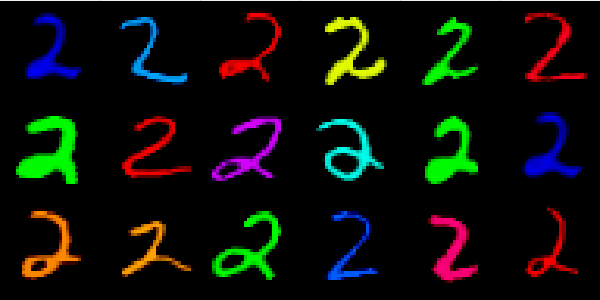

# Field Matching: an Electrostatic Paradigm to Generate and Transfer Data (ICML 2025)

This is the official `Python` implementation of the [ICML 2025](https://icml.cc/virtual/2025/poster/46213) paper  **Field Matching: an Electrostatic Paradigm to Generate and Transfer Data** by [Alexander Kolesov](https://scholar.google.com/citations?user=vX2pmScAAAAJ&hl=ru&oi=ao), Stepan Manukhov , [Vladimir V. Palyulin](https://scholar.google.com/citations?user=IcjnBqkAAAAJ&hl=ru&oi=sra) and [Alexander Korotin](https://scholar.google.com/citations?user=1rIIvjAAAAAJ&hl=ru&oi=sra).

The repository contains reproducible PyTorch source code for computing maps for noise-to-data as well as data-to-data scenarios in high dimensions with neural networks. Examples are provided for toy 3D problems, unconditional data generation and unpaired translation problems.

<p align="center"></p>

## Pre-requisites

The implementation is GPU-based. Single GPU GTX 1080 ti is enough to run each particular experiment. We tested the code with `torch==2.1.1+cu121`. The code might not run as intended in older/newer `torch` versions. Versions of other libraries are specified in `requirements.txt`. 

 
## Repository structure

All the experiments are issued in the form of pretty self-explanatory jupyter notebooks.

- `src` - auxiliary source code for the constructing of the neural network model.
- `notebooks/EFMToy.ipynb` - the notebook of 3D illustrative examples
- `notebooks/EFMCMGeneration.ipynb` - the notebook of the noise-to-image generation on Colored MNIST dataset.
- `notebooks/EFMCIFAR10Generation.ipynb` - the notebook of the noise-to-image generation on CIFAR-10 dataset.
- 'notebooks/EFMTranslation.ipynb' - the notebook for data-to-data scenario.
- 'poster' - the poster presented at ICML 2025.
- 'slides' - slides presented at ICCML 2025.
 

```console
pip install -r requirements.txt
```
- Download  [MNIST](https://yann.lecun.com/exdb/mnist) dataset
- Donwload  [CIFAR10](https://www.cs.toronto.edu/~kriz/cifar.html) dataset

- Set downloaded dataset in appropriate subfolder in `data/`.

###  Unconditional Data Generation on Colored MNIST and CIFAR-10

<p  align="center">
  
   
</p>

###  Unpaired dataset translation from digits 3 to digits 2

<p  align="center">
  
   
</p>
## Credits
- [Weights & Biases](https://wandb.ai) developer tools for machine learning;
- [UNet architecture](https://github.com/milesial/Pytorch-UNet) for map network;
- [Inkscape](https://inkscape.org/) for the awesome editor for vector graphics;
